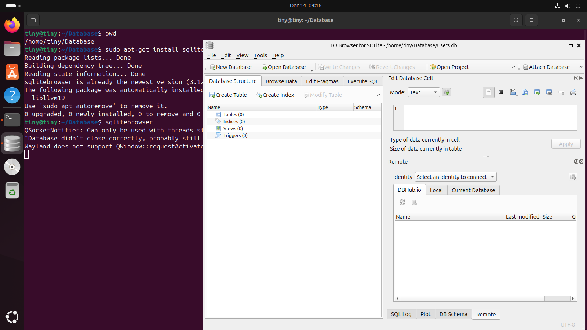

# The Target
When talking about cybersecurity, there is usually an attacker and a target. However, it would seem that I don't have a target, and finding one on the internet is like pulling a go-to-jail card. So, the best place to start would be creating a target of my own.

## Materials

* VirtualBox 

* Ubuntu

* SQLite

## Plan
I will create a Ubuntu VM (virtual machine) using VirtualBox on my Windows system. This Ubuntu VM will act as the normal database that companies use to store data. Even though PostgreSQL is more widely used and expandable, we will be using SQLite as our data engine since it's lightweight, test-friendly, and simple to use.

* Using sqlitebrowser for visibility

Now that we have most of the tools to create a basic SQL database environment, we must populate the environment with DATABASES! Starting with:

1. Users
2. Cache (password hashes)
3. PassHashes (honeypot)

Personally, I like the idea of having a decoy database (honeypot) in case an attacker is able to gain access to a system. Maybe they'll try to exfiltrate the honeypot and alert the security professionals before things get bad. Let's be real, who would ever be interested in a database named "Cache"?

I created some sample user data along with some password hashes using the id number as the salt and populated the honeypot with nonsense data. In this example, I used the MD5sum hashing algorithm even though it is out of date and vulnerable. Usually, I would opt for something more secure like Argon2 or bcrypt, but for testing purposes, we will use MD5.

Overall we now have 3 SQL databases:
1. Users
2. "Cache"
3. "PassHashes"

All of which have 3 records of data associated with the users: 
* John
* Sussie
* Blake

This is the perfect starting place for our target/main system we will be working with. 
  <!-- Thank you for your time.  -->

